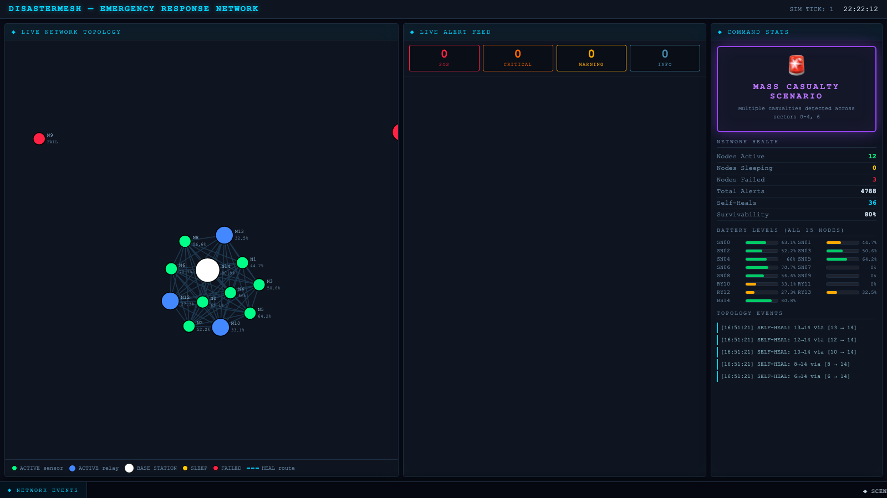
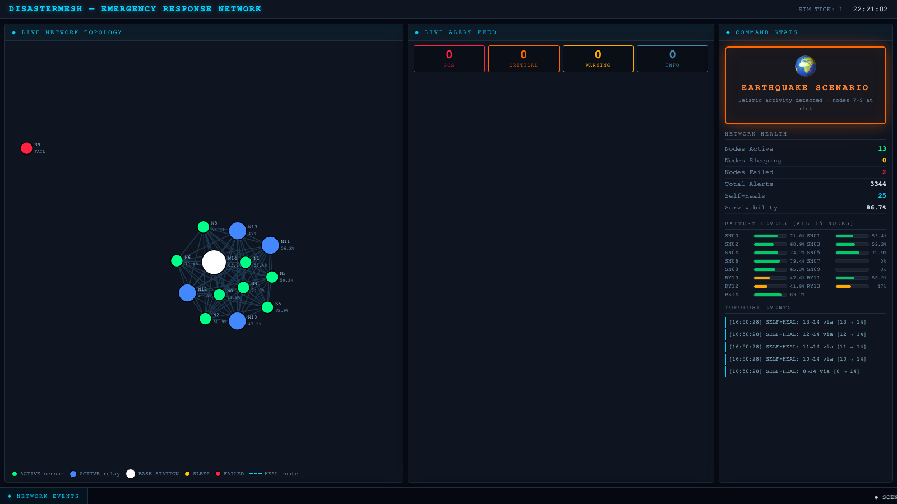

# 🌐 DisasterMesh — Emergency Response Network

> A real-time wireless sensor network (WSN) simulation that models multi-disaster scenarios, self-healing mesh routing, and live emergency dispatch — all visualized in a D3.js dashboard.


---

## ✨ Features

- **15-Node Mesh Network** — 10 sensors, 4 relay nodes, 1 base station arranged on a geographic grid
- **3 Disaster Scenarios** — FIRE (nodes 3-5), EARTHQUAKE (nodes 7-9), MASS CASUALTY (nodes 0-4, 6)
- **Dijkstra + Flood Routing** — primary shortest-path routing with automatic BFS flooding fallback
- **Self-Healing** — failed nodes are detected and affected routes are instantly rerouted
- **Priority Alert Queue** — SOS → CRITICAL → WARNING → INFO, scored by weighted multi-sensor analysis
- **Live Dashboard** — real-time D3.js force-directed network graph with SocketIO event streaming
- **SQLite Persistence** — every alert is persisted with GPS coordinates, score, and dispatch status
- **REST API** — topology, alerts, and emergency dispatch endpoints

---

## 🛠 Tech Stack

| Layer | Technology |
|---|---|
| Simulation Engine | Python 3.12, NetworkX 3.6 |
| Web Backend | Flask 3.1, Flask-SocketIO 5.6 (threading mode) |
| Database | SQLite (via stdlib `sqlite3`) |
| Frontend | D3.js v7, Socket.IO 4.7 (vendored locally, no external CDN) |
| Routing | Dijkstra (NetworkX) + BFS Flood fallback |
| Deployment | Gunicorn (gthread worker) |

---

## 📸 Screenshots

| Dashboard View | Network Topology |
|---|---|
|  |  |

---

## 🚀 Live Demo

> **[https://disastermesh.onrender.com](https://disastermesh.onrender.com)**

---

## 🖥 How to Run Locally

### Prerequisites
- Python 3.12+ (3.14 works locally; see [Deployment Notes](#deployment-notes))
- Git

### Setup

```bash
# 1. Clone the repository
git clone https://github.com/YOUR_USERNAME/DisasterMesh.git
cd DisasterMesh

# 2. Create and activate virtual environment
python3 -m venv .venv
source .venv/bin/activate          # macOS/Linux
# .venv\Scripts\activate           # Windows

# 3. Install dependencies
pip install -r requirements.txt

# 4. Run the CLI simulation (standalone, no server required)
python simulate.py

# 5. Start the live dashboard
python dashboard/app.py
# Open http://localhost:5001 in your browser
```

The dashboard auto-loops through all 3 scenarios. The SQLite database is created automatically at `data/alerts.db` on first run.

### Running Tests

```bash
pip install -r requirements-dev.txt
pytest -q
```

Covers Dijkstra/flood routing, severity scoring thresholds, self-healing/failover, node battery duty-cycling, and the Flask API routes. Runs automatically on every push via [GitHub Actions](.github/workflows/ci.yml).

### API Endpoints

| Method | Endpoint | Description |
|---|---|---|
| GET | `/api/topology` | Returns all 15 nodes + 105 edges |
| GET | `/api/alerts` | Returns last 50 alerts from SQLite |
| POST | `/api/dispatch/<alert_id>` | Marks an alert as RESPONDED |

---

## 📁 Project Structure

```
DisasterMesh/
├── alerts/
│   ├── engine.py          # Alert priority queue + SQLite persistence
│   └── scoring.py         # Weighted severity scoring (0–100)
├── core/
│   ├── network.py         # Mesh network graph engine (NetworkX)
│   ├── node.py            # SensorNode: battery, duty-cycle, state
│   ├── routing.py         # Dijkstra routing + BFS flood fallback
│   └── sensor.py          # Sensor data generators per scenario
├── dashboard/
│   ├── app.py             # Flask + SocketIO live dashboard server
│   └── templates/
│       └── index.html     # D3.js network visualization UI
├── data/
│   └── alerts.db          # SQLite DB (gitignored, auto-created)
├── simulate.py            # CLI simulation runner (no server needed)
├── Procfile               # Gunicorn deployment config
├── runtime.txt            # Python version for deployment platforms
├── requirements.txt
└── LICENSE
```

---

## 📡 SocketIO Events

The dashboard subscribes to these real-time events:

| Event | Payload |
|---|---|
| `alert_event` | `{alert_id, level, node_id, sensor_type, value, gps, timestamp}` |
| `node_status_batch` | `[{node_id, state, battery_level, node_type}, ...]` (all 15 nodes, one event per tick) |
| `topology_change` | `{type: "fail"\|"heal", node_id, new_route}` |
| `scenario_change` | `{name, icon, description}` |
| `stats_update` | `{active, sleeping, failed, total_alerts, heals, survivability}` |

---

## 🗺 Known Limitations / Roadmap

- [#1](https://github.com/uplsiddharth-byte/DisasterMesh/issues/1) — the BFS flood-routing fallback can't currently trigger in practice (the 15-node mesh is fully connected, so Dijkstra never fails).
- [#2](https://github.com/uplsiddharth-byte/DisasterMesh/issues/2) — `/api/dispatch/<alert_id>` returns success even for an alert ID that doesn't exist.
- No authentication on the dispatch endpoint — fine for a simulation demo, would need to change before any real-world use.
- `/api/alerts` always returns the latest 50 rows with no pagination.

---

## 🏗 Deployment Notes

Deployment platforms (Render, Railway) currently support up to Python **3.12**. If your local environment uses Python 3.14, you may need to create a fresh venv with Python 3.12 when deploying. The `runtime.txt` file pins this to 3.12.

---

## 👤 Author

**Siddharth** — WSN Simulation Project

---

## 📄 License

This project is licensed under the [MIT License](LICENSE).
